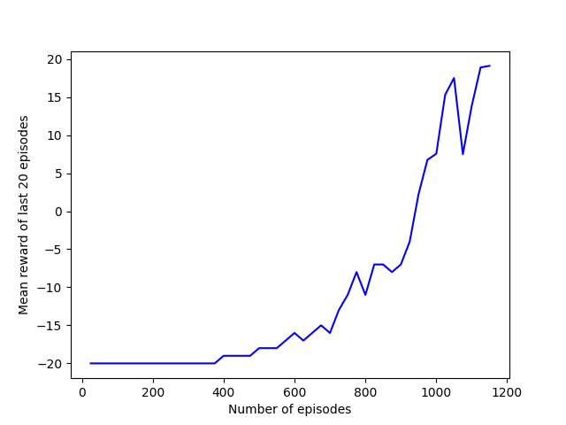
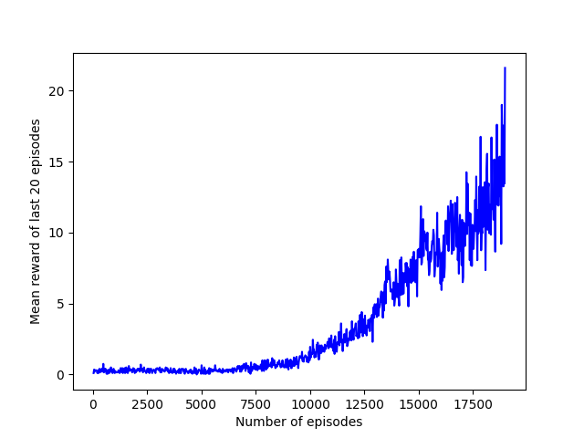

# Atari Duel DQN

## Introduction

This project demonstrates the application of the Dueling DQN algorithm for trainning a reinforcement learning agent that can learn how to play Atari 2600 games. This has been a project for my EESC 7v85.001 class Special Topics in Signal Processing: Neural Networks and Deep Learning under Prof. Berrak Sisman.

In this project, we implement the Dueling DQN algorithm as described [here](https://arxiv.org/abs/1511.06581).

## How to Run

`dqnpolicy.py` is script you want to run. To train the agent, simply run the `main()` method. To test a trained policy, you can use the `DQNPolicy.play_policy(policy_path, render=True)` method.

To test the already trained policies present in the `models` directory, simply select the game you desire from the `demo_dict` variable and in the `__main__` scope, run the `DQNPolicy.play_policy(policy_path, render=True)` command.

I kinda fucked up when uploading the project on GitHub, so I lost the learned policy for Breakout \**womp womp*\*

## Files

<ol>
<li> dqnpolicy.py - Implementation of the algorithm. Contains the main method
<li> qnetwork.py - Implementation of the Q-network.
<li> random_policy.py - Implements a random policy.
<li> utils.py - Utilities.1
</ol>

## Results

We train this agent on three games - [Pong](https://atariage.com/manual_html_page.php?SoftwareLabelID=587), [Breakout](https://atariage.com/manual_html_page.php?SoftwareID=889) and [Space Invaders](https://atariage.com/manual_html_page.php?SoftwareLabelID=460).

Below are the plots for mean training score vs episodes trained for. Training time varies- 6-7 hours for Pong, 10-12 hours for Breakout and ~24 hours for Space Invaders, for the level of performance as described in the plots below.

### Pong

### Breakout

### Space Invaders
